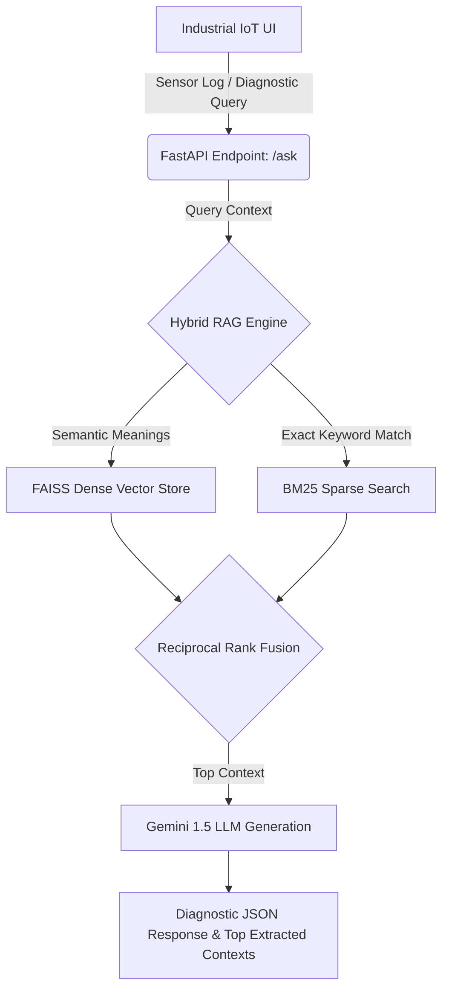

<div align="center">
  <h1>⚙️ MaintainIQ</h1>
  <p><b>Advanced Industrial IoT Predictive Maintenance Engine</b></p>
  
  [](https://www.python.org)
  [](https://fastapi.tiangolo.com)
  [](https://github.com/facebookresearch/faiss)
  [](https://pypi.org/project/rank-bm25/)
</div>

---

## 🚀 Overview
**MaintainIQ** is a state-of-the-art predictive maintenance Diagnostic AI designed specifically for Industrial IoT environments. To solve the classic RAG limitation of missing exact keyword matches vs missing semantic meaning, MaintainIQ employs a completely offline **Hybrid Search Architecture**.

By simultaneously querying a Dense Vector Database (FAISS) and a Sparse Keyword Search (BM25Okapi), and combining the results using **Reciprocal Rank Fusion (RRF)**, MaintainIQ guarantees zero hallucinations when retrieving highly technical engineering manuals.

## 🏗️ Architecture


## 🧠 Core Features
1. **Reciprocal Rank Fusion (RRF)**: Synthesizes BM25 and FAISS scoring to perfectly extract correct manual chunks.
2. **Offline-First Vector Search**: Uses local CPU-bound FAISS to avoid heavy cloud DB dependencies like Pinecone, keeping data perfectly secure on the edge.
3. **Dark Industrial UI**: A specialized dashboard that explicitly renders the extracted RRF mathematical contexts back to the technician along with the AI generation.

## 🛠️ Setup & Installation

### 1. Clone the Repository
```bash
git clone https://github.com/blackmangoo/MaintainIQ.git
cd MaintainIQ
```

### 2. Environment Setup
```bash
python -m venv venv
.\venv\Scripts\activate
pip install -r requirements.txt
```

### 3. API Keys
Create a `.env` file pointing to your LLM generator:
```env
GEMINI_API_KEY=your_key_here
```

### 4. Run the RAG Engine
```bash
uvicorn app.main:app --host 0.0.0.0 --port 8002 --reload
```
Visit `http://localhost:8002/` to access the Industrial IoT Diagnostic Terminal!
